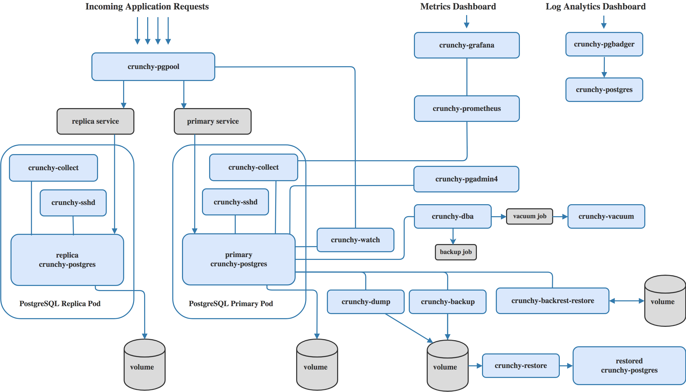

= Crunchy Container Overview
Crunchy Data Solutions, Inc.
v1.7, {docdate}
:title-logo-image: image::images/crunchy_logo.png["CrunchyData Logo",align="center",scaledwidth="80%"]

== Introduction

In this document, we will describe each of the containers found
within the Crunchy Containers for PostgreSQL.

The containers and their relationships to the overall architecture
are depicted below:

== crunchy-postgres

The crunchy-postgres container executes the Postgres database.

=== Packages

The container image is built using either the Crunchy Postgres release
or the community version based upon a flag in the Makefile.

The crunchy-postgres RPMs are available to Crunchy customers only.  The
Crunchy release is meant for customers that require enterprise level
support.

The PGDG community RPMs can be used as well by simply commenting out
the Crunchy yum repo within the Dockerfiles and uncommenting
the PGDG yum repo.

=== setup.sql

The *setup.sql* script is used to define startup SQL commands that are
executed when the database is first created.

=== Environment Variables

 * PG_MODE - either *primary*, *replica* or *set*, this value determines whether
   the database is set up as a primary or replica instance. In the
   case of *set*, it means the container is started within a StatefulSet
   in a Kubernetes cluster.
 * PG_PRIMARY_USER - the value to use for the user ID created as
   primaryuser.  The *primaryuser* has super user privileges.
 * PG_PRIMARY_PASSWORD - the password for the PG_PRIMARY_USER database user
 * PG_USER - the value to use for the user ID created as a normal user.
   This user is created as part of the setup.sql script upon database
   creation and allows users to predefine an application user.
 * PG_PASSWORD - the password for the PG_USER database user that is created
 * PG_DATABASE - a database that is created upon database initialization
 * PG_ROOT_PASSWORD - the PostgreSQL user password set up upon database
   initialization
 * PG_LOCALE - if set, the locale you want to create the database with, if
   not set, the default locale is used
 * SYNC_REPLICA - if set, this value is used to specify the application_name
   of a replica that will be used for a synchronous replication
 * CHECKSUMS - if set, this value is used to enable the *--data-checksums*
   option when initdb is executed at initialization, if not set, the
   default is to *not* enable data checksums
 * ARCHIVE_MODE - if set to *on*, will enable continuous WAL archiving
   by setting the value within the postgresql.conf file *archive_mode*
   setting, if not set, the default is *off*
 * ARCHIVE_TIMEOUT - if set to a number (in seconds) , will specify
   the postgresql.conf *archive_timeout* setting, if not set, the
   default value of *60* is used.
 * PGAUDIT_ANALYZE - if set, will cause the container to also start the
   pgaudit_analyze program in the background
 * PGDATA_PATH_OVERRIDE - if set, will cause the container to use a /pgdata path
   name of your choosing rather than the hostname of the container which
   is the default. This is useful for a primary in a deployment.
 * XLOGDIR - if set to true, will cause initdb to include --xlogdir=$PGWAL, this
   will cause a symlink to be created from /pgdata/containername/pg_xlog to /pgwal/containername-wal

=== Features

The following features are supported by the crunchy-postgres container:

 * use of OpenShift secrets
 * ability to restore from a database backup
 * use of custom pg_hba.conf and postgresql.conf files
 * ability to override postgresql.conf configuration parameters
 * ability to override the default setup.sql script
 * ability to set the database locale
 * ability to specify a synchronous replica application_name
 * ability to specify a recovery using PITR and WAL files, see
   pitr.adoc for a detailed design explanation of how PITR
   is implemented within the container suite

=== Locale Support

Adding locale support to the container is accomplished by
running 'yum reinstall glibc_common' within the container, this
increases the size of the container image and can be removed if you
do not require specific locale support.

You can specify the PG_LOCALE env var which is passed to the initdb
command when the initial data files are created, for example:
....
"name": "PG_LOCALE",
"value": "fr_BE.UTF-8"
....

By default, no locale is specified when the initdb command is executed.

== crunchy-postgres-gis

This container is the same as the crunchy-postgres container except
that it includes the following PostgreSQL extensions:

 * postgis
 * pl/r

You can test the pl/r extension by running the following commands
for example:
....
create extension plr;
SELECT * FROM plr_environ();
SELECT load_r_typenames();
SELECT * FROM r_typenames();
SELECT plr_array_accum('{23,35}', 42);
CREATE OR REPLACE FUNCTION plr_array (text, text)
RETURNS text[]
AS '$libdir/plr','plr_array'
LANGUAGE 'c' WITH (isstrict);
select plr_array('hello','world');
....

== crunchy-backup

The crunchy-backup container executes a pg_basebackup against another
database container.  The backup is a full backup using the standard
utility included with PostgreSQL, pg_basebackup.

=== Backup Location

Backups are stored in a mounted backup volume location, using the
database host name plus *-backups*  as a sub-directory, then followed by a unique
backup directory based upon a date/timestamp.  It is left to the
user to perform database backup archives in this current version
of the container.  This backup location is referenced when performing
a database restore.

=== Dependencies

The container is meant to be using a NFS or similar network file system
to persist database backups.

=== Environment Variables

 * BACKUP_LABEL - when set, will set the label of the backup, if not
   set the default label used is *crunchy-backup*
 * BACKUP_HOST - required, this is the database we will be doing the
   backup for
 * BACKUP_USER - required, this is the database user we will be doing the
   backup with
 * BACKUP_PASS - required, this is the database password we will be doing the
   backup with
 * BACKUP_PORT - required, this is the database port we will be doing the
   backup with

== crunchy-collect

=== Description

70 different PostgreSQL metrics are collected by the crunchy-collect container,
which executes both the postgres_exporter and node_exporter. Written in Go, these
are both metrics exporters that work with Prometheus to provide PostgreSQL server
metrics in addition to hardware and OS metrics. The crunchy-collect container gathers
different metrics from the crunchy-postgres PostgreSQL database container and
pushes these to the Prometheus Promgateway (crunchy-promgateway).

A full description with examples of the metrics collection containers is available
link:https://github.com/CrunchyData/crunchy-containers/blob/master/docs/metrics.adoc[here].

=== Requirements

Metrics are stored in the crunchy-prometheus container, which is the container that runs
the Prometheus time series database. Metrics are pushed from
crunchy-collect to the Prometheus promgateway found in the crunchy-promgateway
container.  Metrics dashboards are created using the Grafana web application
which is found in the crunchy-grafana container.

=== Environment Variables

 * PROM_GATEWAY - The HTTP URL of the Prometheus Pushgateway into which the metrics will be pushed
 * NODE_EXPORTER_URL - The HTTP URL of the node_exporter utility which collects host and OS level system metrics.
 * POSTGRES_EXPORTER_URL - The HTTP URL of the postgres_exporter utility which collects PostgreSQL server metrics.
 * DATA_SOURCE_NAME - The URL for the PostgreSQL server's data source name. This is *required* to be in the form of *postgresql://*.

== crunchy-prometheus

=== Description

The container crunchy-collect collects PostgreSQL metrics from the crunchy-postgres database container
and pushes them to a Prometheus time series data store, which is located in this crunchy-prometheus container.
Prometheus is a flexible, highly dimensional time series data model that stores data efficiently,
where time series are defined through a metric name and set of key-value pairs.

Prometheus is a multi-dimensional time series data model with an elastic query language. It is used in collaboration
with Grafana in this metrics suite. Overall, it’s reliable, manageable, and operationally simple for efficiently
storing and analyzing data for large-scale environments. It targets the Promgateway as an endpoint for scraping metrics.

A full description with examples of the metrics collection containers is available
link:https://github.com/CrunchyData/crunchy-containers/blob/master/docs/metrics.adoc[here].

The following port is exposed by the crunchy-prometheus container:

 * crunchy-prometheus:9090 - the Prometheus web user interface

=== Requirements

The crunchy-prometheus data in this example is stored in emptyDir volume types.
To persist the data and Grafana templates in the long term, you will want to
use a pvc based volume type as specified in *examples/openshift/metrics/run-pvc.json*.

== crunchy-promgateway

=== Description

crunchy-promgateway is the Prometheus gateway into which the metrics will be pushed from
crunchy-prometheus. The types of collected metrics as well as their status are viewable
from the REST API on port 9091.

A full description with examples of the metrics collection containers is available
link:https://github.com/CrunchyData/crunchy-containers/blob/master/docs/metrics.adoc[here].

The following port is exposed by the crunchy-promgateway container:

* crunchy-promgateway:9091 - the Prometheus promgateway REST API

== crunchy-grafana

=== Description

Visual dashboards are created from the collected and stored data that crunchy-collect and crunchy-prometheus
provides with the crunchy-grafana container, which hosts a web-based graphing dashboard called Grafana.

Grafana is an open-source platform which can then apply the defined metrics and visualize information through
various tools. It is extremely flexible with a powerful query and transformation language, producing beautiful
and easily understandable graphics to analyze and monitor your data.

A full description with examples of the metrics collection containers is available
link:https://github.com/CrunchyData/crunchy-containers/blob/master/docs/metrics.adoc[here].

The following port is exposed by the crunchy-grafana container:

* crunchy-grafana:3000 - the Grafana web user interface

== crunchy-pgbadger

The crunchy-pgbadger container executes the pgbadger utility.  A small
http server is running on the container, when a request
is made to:

....
http://<<ip address>>:10000/api/badgergenerate
....

=== Environment Variables

 * BADGER_TARGET - only used in standalone mode to specify the
   name of the container, also used to find the location of the
   database log files in /pgdata/$BADGER_TARGET/pg_log/*.log

=== Features

The following features are supported by the crunchy-pgbadger container:

 * basic invocation of pgbadger against the database log files

== crunchy-pgpool

The crunchy-pgpool container executes the pgpool utility.  Pgpool can
be used to provide a smart PostgreSQL-aware proxy to a PostgreSQL cluster,
both primary and replica, so that applications can only have to work
with a single database connection.

Postgres replicas are read-only whereas a primary is both read and write
capable.

=== Environment Variables

 * PG_USERNAME - user to connect to PostgreSQL
 * PG_PASSWORD - user password to connect to PostgreSQL
 * PG_PRIMARY_SERVICE_NAME - database host to connect to for the primary node
 * PG_REPLICA_SERVICE_NAME - database host to connect to for the replica node

=== Features

The following features are supported by the crunchy-pgpool container:

 * basic invocation of pgpool

== crunchy-watch

We create a container, crunchy-watch, that runs as a pod unto itself
typically.  The watch container essentially does a health check
on a primary database container and performs a failover sequence
if the primary is not reached.

The watch container has access to a service account that is used
inside the container to issue commands to OpenShift.

You set up the SA using this:

oc create -f watch-sa.json

You then set up permissions for the SA to edit the OpenShift project,
this example allows all service accounts to edit resources in the *default*
project:

....
oc policy add-role-to-group edit system:serviceaccounts -n default
....

In Kube 1.5, if a policy file is being used for securing down the
Kube cluster, you could possibly need to add a policy to allow
the pg-watcher service account access to the Kube API as mentioned
here: https://kubernetes.io/docs/admin/authorization/abac/#a-quick-note-on-service-accounts

In Kube 1.6, an equivalent RBAC policy is also possibly required depending
on your authorization/authentication configuration.  See this
link for details on the new RBAC policy mechanism:
https://kubernetes.io/docs/admin/authorization/rbac/

For example, you can grant cluster-admin permissions on the pg-watcher service
account, in the my-namespace namespace as follows:
....
kubectl create clusterrolebinding pgwatcher-view-binding --clusterrole=cluster-admin --serviceaccount=my-namespace:pg-watcher
....

A less wide open policy would be applied like this on Kube 1.6 rbac:
....
kubectl create rolebinding my-sa-binding --clusterrole=admin --serviceaccount=default:pg-watcher --namespace=default
....

NOTE:  this kubectl command is only available in Kube 1.6, for prior
Kube release such as 1.5 and the alpha RBAC, you will need to
specify the role binding in a JSON/YAML file instead of using
this command syntax above.

You then reference the SA within the POD spec.

The oc/docker/kubectl commands are included into the container from the
host when the container image is built.  These commands are used by
the watch logic to interact with the replica containers.

=== Environment Variables

 * SLEEP_TIME - the time to sleep in seconds between checking on the primary
 * WAIT_TIME - the time to sleep in seconds between triggering the failover and updating its label (default is 40 secs)
 * PG_CONTAINER_NAME -  if set, the name of the container to refer to when doing an *exec*, this is required if you have more than 1 container in your database pod
 * PG_PRIMARY_SERVICE -  the primary service name
 * PG_REPLICA_SERVICE - the replica service name
 * PG_PRIMARY_PORT - database port to use when checking the database
 * PG_PRIMARY_USER -  database user account to use when checking the database
   using pg_isready utility
 * PG_DATABASE - database to use when checking the database using pg_isready
 * REPLICA_TO_TRIGGER_LABEL - the pod name of a replica that you
   want to choose as the new primary in a failover; this will override
   the normal replica selection
 * WATCH_PRE_HOOK - path to an executable file to run before failover is processed.
 * WATCH_POST_HOOK - path to an executable file to run after failover is processed.

=== Logic

The watch container will watch the primary, if the primary dies, then
the watcher will:

 * create the trigger file on the replica that will become the new primary
 * change the labels on the replica to be those of the primary
 * start watching the new primary in case that falls over next
 * look for replicas that have the metadata label value of *replicatype=trigger* to prefer
   the failover to. If found, it will use the first replica with that label,; if
   not found, it will use the first replica it finds.

Example of looking for the failover replica:
....
oc get pod -l name=pg-replica-rc-dc
NAME                     READY     STATUS    RESTARTS   AGE
pg-replica-rc-dc           1/1       Running   2          16m
pg-replica-rc-dc-1-96qs8   1/1       Running   1          16m

oc get pod -l replicatype=trigger
NAME             READY     STATUS    RESTARTS   AGE
pg-replica-rc-dc   1/1       Running   2          16m
....

== crunchy-vacuum

=== Description

The crunchy-vacuum container allows you to perform a SQL VACUUM job against a PostgreSQL database container.
You specify a database to vacuum using various environment variables which are listed below. It is possible
to run different vacuum operations either manually or automatically through scheduling.

The crunchy-vacuum image is executed, passed in the Postgres connection parameters to the single-primary
PostgreSQL container. The type of vacuum performed is dictated by the environment variables passed into the job.

=== Environment Variables

The complete set of environment variables read by the crunchy-vacuum job include:

    * VAC_FULL - when set to true adds the FULL parameter to the VACUUM command
    * VAC_TABLE - when set, allows you to specify a single table to vacuum, when not specified, the entire database tables are vacuumed
    * JOB_HOST - required variable is the postgres host we connect to
    * PG_USER - required variable is the postgres user we connect with
    * PG_DATABASE - required variable is the postgres database we connect to
    * PG_PASSWORD - required variable is the postgres user password we connect with
    * PG_PORT - allows you to override the default value of 5432
    * VAC_ANALYZE - when set to true adds the ANALYZE parameter to the VACUUM command
    * VAC_VERBOSE - when set to true adds the VERBOSE parameter to the VACUUM command
    * VAC_FREEZE - when set to true adds the FREEZE parameter to the VACUUM command

== crunchy-dba

The crunchy-dba container implements a cron scheduler.  The purpose
of the crunchy-dba container is to offer a way to perform
simple DBA tasks that occur on some form of schedule such as
backup jobs or running a vacuum on a *single* Postgres database container.

You can either run the crunchy-dba container as a single pod or include
the container within a database pod.

The crunchy-dba container makes use of a Service Account to perform
the startup of scheduled jobs.  The Kube Job type is used to execute
the scheduled jobs with a Restart policy of Never.

=== Environment Variables

The following environment variables control the actions
of crunchy-dba:

 * OSE_PROJECT - required, the OSE project name to log into
 * JOB_HOST - required, the PostgreSQL container name the action will be taken against
 * VAC_SCHEDULE - if set, this will start a vacuum job container.  The
 setting value must be a valid cron expression as described below.
 * BACKUP_SCHEDULE - if set, this will start a backup job container.  The
 setting value must be a valid cron expression as described below.

For a vacuum job, you are required to supply the following
environment variables:

 * JOB_HOST
 * PG_USER
 * PG_PASSWORD
 * PG_DATABASE - defaults to postgres when not specified
 * PG_PORT - defaults to 5432 when not specified
 * VAC_ANALYZE(optional) - defaults to true when not specified
 * VAC_FULL(optional) - defaults to true when not specified
 * VAC_VERBOSE(optional) - defaults to true when not specified
 * VAC_FREEZE(optional) - defaults to false when not specified
 * VAC_TABLE(optional) - defaults to all tables when not specified, or you can set this value to indicate a single table to vacuum

For a backup job, you are required to supply the following
environment variables:

 * JOB_HOST
 * PG_USER - database user used to perform the backup
 * PG_PASSWORD - database user password used to perform the backup
 * PG_PORT - port value used when connecting for a backup to the database
 * BACKUP_PV_CAPACITY - a value like 1Gi is used to define the PV storage capacity
 * BACKUP_PV_PATH - the NFS path used to build the PV
 * BACKUP_PV_HOST - the NFS host used to build the PV
 * BACKUP_PVC_STORAGE - a value like 75M means to allow 75 megabytes for the PVC used
 in performing the backup

=== CRON Expression Format

A cron expression represents a set of times, using 6 space-separated fields.

.Table Fields
|===
|Field name   | Mandatory? | Allowed values  | Allowed special characters

|Seconds
|Yes
|0-59
|* / , -

|Minutes
|Yes
|0-59
|* / , -

|Hours
|Yes
|0-23
|* / , -

|Day of month
|Yes
|1-31
|* / , - ?

|Month
|Yes
|1-12 or JAN-DEC
|* / , -

|Day of week
|Yes
|0-6 or SUN-SAT
|* / , - ?
|===

Note: Month and Day-of-week field values are case insensitive.  "SUN", "Sun",
and "sun" are equally accepted.

==== Special Characters

===== Asterisk ( * )

The asterisk indicates that the cron expression will match for all values
of the field; e.g., using an asterisk in the 5th field (month) would
indicate every month.

===== Slash ( / )

Slashes are used to describe increments of ranges. For example 3-59/15 in
the 1st field (minutes) would indicate the 3rd minute of the hour and every
15 minutes thereafter. The form "*\/..." is equivalent to the form
"first-last/...", that is, an increment over the largest possible range of
the field.  The form "N/..." is accepted as meaning "N-MAX/...", that is,
starting at N, use the increment until the end of that specific range.
It does not wrap around.

===== Comma ( , )

Commas are used to separate items of a list. For example, using
"MON,WED,FRI" in the 5th field (day of week) would mean Mondays,
Wednesdays and Fridays.

===== Hyphen ( - )

Hyphens are used to define ranges. For example, 9-17 would indicate every
hour between 9am and 5pm inclusive.

===== Question mark ( ? )

Question mark may be used instead of '*' for leaving either day-of-month or
day-of-week blank.

==== Predefined schedules

You may use one of several pre-defined schedules in place of a cron expression.

.Table Predefined Schedules
|===
|Entry|Description|Equivalent To

|@yearly (or @annually)
| Run once a year, midnight, Jan. 1st
| 0 0 0 1 1 *

|@monthly
| Run once a month, midnight, first of month
| 0 0 0 1 * *

|@weekly
| Run once a week, midnight on Sunday
| 0 0 0 * * 0

|@daily (or @midnight)
| Run once a day, midnight
| 0 0 0 * * *

|@hourly
| Run once an hour, beginning of hour
| 0 0 * * * *
|===

==== Intervals

You may also schedule a job to execute at fixed intervals.  This is
supported by formatting the cron spec like this:

....
@every <duration>
....

where "duration" is a string accepted by time.ParseDuration
(http://golang.org/pkg/time/#ParseDuration).

For example, "@every 1h30m10s" would indicate a schedule that activates every
1 hour, 30 minutes, 10 seconds.

Note: The interval does not take the job runtime into account.  For example,
if a job takes 3 minutes to run, and it is scheduled to run every 5 minutes,
it will have only 2 minutes of idle time between each run.

==== Time zones

All interpretation and scheduling is done in the machines local
time zone (as provided by the Go time package
(http://www.golang.org/pkg/time).  Be aware that jobs scheduled during
daylight-savings leap-ahead transitions will not be run!

== crunchy-pgbouncer

The crunchy-ppgbouncer container executes the Postgres pgbouncer
utility and a failover watch script.

=== Environment Variables

 * FAILOVER - when set, the container will look at the configured
   primary database and if it can't reach it, will perform a failover
   to a configured replica database
 * OSE_PROJECT - when set, indicates you are running under OSE
 * PG_PRIMARY_USER - the value to use for the user ID created as
   primaryuser.  The *primaryuser* has super user privileges.
 * SLEEP_TIME - time in seconds to sleep when polling the primary
 * PG_DATABASE - the database to use when checking the readiness of the primary
 * PG_PRIMARY_PORT - the PostgreSQL port to use when checking the primary
 * PG_PRIMARY_SERVICE - the name of the primary database container
 * PG_REPLICA_SERVICE - the name of the replica database container, this is
   used to know which container to trigger the failover on

=== Features

The following features are supported by the crunchy-postgres container:

 * mount pgbouncer user.txt and pgbouncer.ini config files via /pgconf volume
 * ability to cause a failover on a configured replica container
 * ability to rewrite the pgbouncer.ini config file and reload pgbouncer
   after a failover

=== Restrictions

 * the name of the primary database in the pgbouncer.ini file is required
   to be *primary*
 * for configuration, has to have users.txt and pgbouncer.ini files mounted in /pgconf

== crunchy-backrest-restore

The crunchy-backrest-restore container executes the pgbackrest utility, allowing FULL and DELTA restore capability. See the pgbackrest guide for more details. https://github.com/pgbackrest/pgbackrest

=== Environment Variables

 * STANZA - required - must be set to the desired stanza for restore
 * DELTA - when set, will add the --delta option to the restore. The delta option allows pgBackRest to automatically determine which files in the database cluster directory can be preserved and which ones need to be restored from the backup — it also removes files not present in the backup manifest so it will dispose of divergent changes.

=== Features

The following features are supported by the crunchy-backrest-restore container:

 * mount pgbackrest.conf config file via /pgconf volume
 * mount the /backrestrepo for access to pgbackrest archives

=== Restrictions

 * for configuration, has to have pgbackrest.conf files mounted in /pgconf
 * must have valid pgbackrest archive directory mounted in /backrestrepo

== crunchy-pgadmin4

The crunchy-ppgadmin4 container executes the pgadmin4 web application.

The pgadmin4 project is found at the following location:
https://www.pgadmin.org/

pgadmin4 provides a web user interface to PostgreSQL databases.  A
sample screenshot is below:

image::images/pgadmin4-screenshot.png["pgadmin screenshot",align="center",scaledwidth="80%"]

=== Environment Variables

 * N/A

=== Features

The following features are supported by the crunchy-pgadmin4 container:

 * mount config_local.py and pgadmin4.db to /data volume inside the
   container to support customization and store the pgadmin4 database
   file
 * expose port 5050 which is the web server port
 * a sample pgadmin4 database is provided with an initial administrator
   user *admin@admin.org* and password of *password*

=== Restrictions

 * N/A

== crunchy-upgrade

The crunchy-upgrade container contains both the 9.5 and 9.6
Postgres packages in order to perform a pg_upgrade from
a 9.5 to a 9.6 version.

=== Environment Variables

 * OLD_DATABASE_NAME - required, refers to the database (pod) name
   that we want to convert
 * NEW_DATABASE_NAME - required, refers to the database (pod) name
   that we give to the upgraded database
 * OLD_VERSION - required, the Postgres version of the old database
 * NEW_VERSION - required, the Postgres version of the new database
 * PG_LOCALE - if set, the locale you want to create the database with, if
   not set, the default locale is used
 * CHECKSUMS - if set, this value is used to enable the *--data-checksums*
   option when initdb is executed at initialization, if not set, the
   default is to *not* enable data checksums
 * XLOGDIR - if set, initdb will use the specified directory for WAL

=== Features

The following features are supported by the crunchy-upgrade container:

 * supports only a pg_upgrade of the Postgres database
 * doesn't alter the old database files
 * creates the new database directory

=== Restrictions

 * does NOT support a postgis upgrade currently
 * all environment variables are required
 * only supports a 9.5 to 9.6 upgrade

== crunchy-sim

The crunchy-sim container is a simple traffic simulator for PostgreSQL

== Environment Variables

* PGSIM_HOST - required, the PostgreSQL host address
* PGSIM_PORT - required, the PostgreSQL host port
* PGSIM_USERNAME - required, the PostgreSQL username
* PGSIM_PASSWORD - required, the PostgreSQL password
* PGSIM_DATABASE - required, the database to connect
* PGSIM_INTERVAL - required, The units of the simulation interval
* PGSIM_MININTERVAL - required, the minimum interval value
* PGSIM_MAXINTERVAL - requited, the maximum interval value

Valid values for PGSIM_INTERVAL are as follows:

* millisecond
* second
* minute

== Features

* Creates a single connection to PostgreSQL and will execute
queries over a specified interval range.
* Queries are specified through a simple YAML file. Each query is a name-value
  pair and can span multiple lines by utilizing scalar notation ("|" or ">") as
  defined by the YAML spec.
* Queries are randomly chosen for execution.

== Restrictions

* Only one connection is created for all queries.

== Legal Notices

Copyright © 2018 Crunchy Data Solutions, Inc.

CRUNCHY DATA SOLUTIONS, INC. PROVIDES THIS GUIDE "AS IS" WITHOUT WARRANTY OF ANY KIND, EITHER EXPRESS OR IMPLIED, INCLUDING, BUT NOT LIMITED TO, THE IMPLIED WARRANTIES OF NON INFRINGEMENT, MERCHANTABILITY OR FITNESS FOR A PARTICULAR PURPOSE.

Crunchy, Crunchy Data Solutions, Inc. and the Crunchy Hippo Logo are trademarks of Crunchy Data Solutions, Inc.
