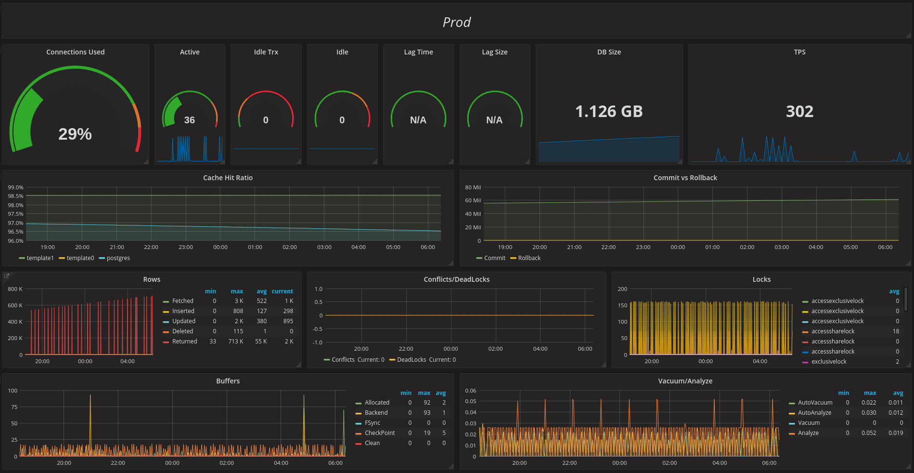
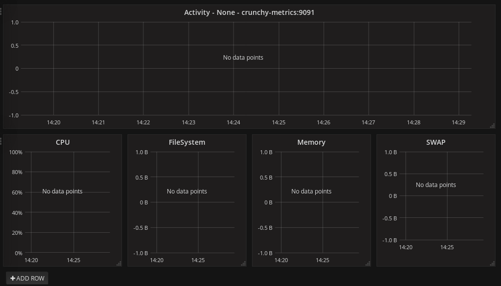

= Metrics Collection - Crunchy Containers for PostgreSQL
Crunchy Data Solutions, Inc.
v1.7, {docdate}
:title-logo-image: image:images/crunchy_logo.png["CrunchyData Logo",align="center",scaledwidth="80%"]

== Description

70 different PostgreSQL metrics are collected by the crunchy-collect container, which executes both the postgres_exporter and node_exporter. Written in Go, these are both metrics exporters that work with Prometheus to provide PostgreSQL server metrics in addition to hardware and OS metrics. The crunchy-collect container gathers different metrics from the crunchy-postgres PostgreSQL database container and pushes these to the Prometheus Promgateway.

The collector is similar to the Prometheus Pushgateway, in that it allows exporting of statistics from batch jobs. It can also be used to export static metrics, such as what role a machine has. These SQL metrics are pushed to the crunchy-promgateway container, which holds the Prometheus Promgateway. This container is then scraped by crunchy-prometheus which hosts Prometheus. Grafana runs from crunchy-grafana, which displays the collected PostgreSQL metrics from the crunchy-prometheus container as a data source and uses the metrics to build dashboards. The Grafana template used is defined by default using a JSON template and is indexed by Grafana as an accessible dashboard.

Prometheus is a multi-dimensional time series data model with an elastic query language. It is used in collaboration with Grafana in this metrics suite. Overall, it’s reliable, manageable, and operationally simple for efficiently storing and analyzing data for large-scale environments. It targets the Promgateway as an endpoint for scraping metrics.

Grafana is open source, adaptable and efficient data conceptualization software. This technology is capable of converting raw data to beautifully represented graphs, allowing you to easily monitor your database with a glance. In addition, it has a strong query and transformation language that allows for instantaneous and complex combinations of metrics, queries, correlations, and mathematical graphing.

To start collection of metrics on a PostgreSQL database, you add the crunchy-collect container into the pod that holds the crunchy-postgres container.

=== Structure

image::images/after.png[alt=Crunchy Containers Metrics Collection,width=700,height=700]

=== Overview

Metrics are stored in the crunchy-prometheus container, which runs the Prometheus time series database. It scrapes the crunchy-collect container which hosts the postgres_exporter and node_exporter for PostgreSQL server metrics as well as host and OS level metrics. These metrics are then pushed to crunchy-grafana in order to visualize the results.

The crunchy-prometheus data in this example is stored in emptyDir volume types. To persist the
data and Grafana templates long term, you will want to use NFS volume types as specified in
the script examples/openshift/metrics/run-pvc.sh.

When running crunchy-metrics, the following ports are available:

 * http://crunchy-metrics:9090 - the Prometheus web user interface
 * http://crunchy-metrics:9091 - the Prometheus pushgateway REST API
 * http://crunchy-metrics:3000 - the Grafana web user interface

=== Environment Variables

 * PROM_GATEWAY - The HTTP URL of the Prometheus Pushgateway into which the metrics will be pushed
 * NODE_EXPORTER_URL - The HTTP URL of the node_exporter utility which collects host and OS level system metrics.
 * POSTGRES_EXPORTER_URL - The HTTP URL of the postgres_exporter utility which collects PostgreSQL server metrics.
 * DATA_SOURCE_NAME - The URL for the PostgreSQL server's data source name. This is *required* to be in the form of *postgresql://*.

=== Examples

==== Docker

You can collect various PostgreSQL metrics from your database container by running a
crunchy-collect container that points to your database container.

To start this set of containers, run the following:
....
cd $CCPROOT/examples/docker/metrics
./run.sh
....

This will start up 3 containers and services:

 * http://crunchy-metrics:9090 - the Prometheus web user interface
 * http://crunchy-metrics:9091 - the Prometheus pushgateway REST API
 * http://crunchy-metrics:3000 - the Grafana web user interface

An example has been provided that runs a database container
and also the associated metrics collection container, run the
example as follows:

....
cd $CCPROOT/examples/docker/collect
./run.sh
....

Every 3 minutes the collection container will collect PostgreSQL
metrics and push them to the Crunchy Prometheus database.  You
can graph them using the Crunchy Grafana container.

If firewalld is enabled in your environment, it may be necessary
to allow the necessary ports through the firewall. This can be
accomplished by the following:

....
firewall-cmd --permanent --new-zone metrics
firewall-cmd --permanent --zone metrics --add-port 9090/tcp
firewall-cmd --permanent --zone metrics --add-port 9091/tcp
firewall-cmd --permanent --zone metrics --add-port 3000/tcp
firewall-cmd --reload
....

==== Kubernetes

This example starts up Prometheus and Grafana.

It is required to view or capture metrics collected by crunchy-collect.

Running the example:
....
cd $CCPROOT/examples/kube/metrics
./run.sh
....

This will start up 3 containers and services:

 * http://crunchy-metrics:9090 - the Prometheus web user interface
 * http://crunchy-metrics:9091 - the Prometheus pushgateway REST API
 * http://crunchy-metrics:3000 - the Grafana web user interface

If you want your metrics and dashboards to persist to NFS, run
this script:
....
cd $CCPROOT/examples/kube/metrics
./run-pvc.sh
....

In the docs folder of the github repo, check out the metrics.adoc
for details on the exact metrics being collected.

This example runs a pod that includes a database container and
a metrics collection container. A service is also created for the pod.

Running the example:
....
cd $CCPROOT/examples/kube/collect
./run.sh
....

If firewalld is enabled in your environment, it may be necessary
to allow the necessary ports through the firewall. This can be
accomplished by the following:

....
firewall-cmd --permanent --new-zone metrics
firewall-cmd --permanent --zone metrics --add-port 9090/tcp
firewall-cmd --permanent --zone metrics --add-port 9091/tcp
firewall-cmd --permanent --zone metrics --add-port 3000/tcp
firewall-cmd --reload
....

You can view the collect container logs using this command:
....
kubectl logs -c collect primary-collect
....

You can access the database or drive load against it using
this command:
....
psql -h primary-collect -U postgres postgres
....

==== OpenShift

This example starts up Prometheus and Grafana.

It is required to view or capture metrics collected by crunchy-collect.

First, create the crunchy-metrics pod which contains
the Prometheus data store and the Grafana graphing web application:

....
cd $CCPROOT/examples/openshift/metrics
./run.sh
....

This will start up 3 containers and services:

 * http://crunchy-metrics:9090 - the Prometheus web user interface
 * http://crunchy-metrics:9091 - the Prometheus pushgateway REST API
 * http://crunchy-metrics:3000 - the Grafana web user interface

When accessing the Grafana web application, the default user credentials will be
the username **admin** and the password **admin**.

Next, start a PostgreSQL pod that has the crunchy-collect container
as follows:
....
cd $CCPROOT/examples/openshift/collect
./run.sh
....

At this point, metrics will be collected every 3 minutes and pushed
to Prometheus.  You can build graphs off the metrics using Grafana.

If firewalld is enabled in your environment, it may be necessary
to allow the necessary ports through the firewall. This can be
accomplished by the following:

....
firewall-cmd --permanent --new-zone metrics
firewall-cmd --permanent --zone metrics --add-port 9090/tcp
firewall-cmd --permanent --zone metrics --add-port 9091/tcp
firewall-cmd --permanent --zone metrics --add-port 3000/tcp
firewall-cmd --reload
....

== Collected Metrics

=== node_exporter

The tables below list all existing collectors that are gathered by the node_exporter.

.*Enabled by Default*

[format="csv", options="header"]
|===
Name, Description
arp, Exposes ARP statistics from `/proc/net/arp`.
bcache, Exposes bcache statistics from `/sys/fs/bcache/`.
conntrack, Shows conntrack statistics (does nothing if no `/proc/sys/net/netfilter/` present).
cpu, Exposes CPU statistics,
diskstats, Exposes disk I/O statistics.
edac, Exposes error detection and correction statistics.
entropy, Exposes available entropy.
exec, Exposes execution statistics.
filefd, Exposes file descriptor statistics from `/proc/sys/fs/file-nr`.
filesystem, Exposes filesystem statistics, such as disk space used.
hwmon, Expose hardware monitoring and sensor data from `/sys/class/hwmon/`.
infiniband, Exposes network statistics specific to InfiniBand and Intel OmniPath configurations.
ipvs, Exposes IPVS status from `/proc/net/ip_vs` and stats from `/proc/net/ip_vs_stats`.
loadavg, Exposes load average.
mdadm, Exposes statistics about devices in `/proc/mdstat` (does nothing if no `/proc/mdstat` present).
meminfo, Exposes memory statistics.
netdev, Exposes network interface statistics such as bytes transferred.
netstat, Exposes network statistics from `/proc/net/netstat`. This is the same information as `netstat -s`.
sockstat, Exposes various statistics from `/proc/net/sockstat`.
stat, Exposes various statistics from `/stat`. This includes boot time & forks as well as interrupts.
textfile, Exposes statistics read from local disk. The `--collector.textfile.directory` flag must be set.
time, Exposes the current system time.
uname, Exposes system information as provided by the uname system call.
vmstat, Exposes statistics from `/proc/vmstat`.
wifi, Exposes WiFi device and station statistics.
xfs, Exposes XFS runtime statistics.
zfs, Exposes link:http://open-zfs.org/[ZFS] performance statistics.
|===

.*Disabled by Default*

The following table contains metrics that are not enabled by default; these can be enabled using the `--collectors.enabled` flag.

[format="csv", options="header"]
|===
Name, Description
bonding, Exposes the number of configured and active replicas of Linux bonding interfaces.
buddyinfo, Exposes statistics of memory fragments as reported by `/proc/buddyinfo`.
devstat, Exposes device statistics
drbd, Exposes Distributed Replicated Block Device statistics (to version 8.4)
interrupts, Exposes detailed interrupts statistics.
ksmd, Exposes kernel and system statistics from `/sys/kernel/mm/ksm`.
logind, Exposes session counts from link:http://www.freedesktop.org/wiki/Software/systemd/logind/[logind].
meminfo\_numa, Exposes memory statistics from `/proc/meminfo_numa`.
mountstats, Exposes filesystem statistics from `/proc/self/mountstats`. Exposes detailed NFS client statistics.
nfs, Exposes NFS client statistics from `/proc/net/rpc/nfs`. This is the same information as `nfsstat -c`.
qdisc, Exposes link:https://en.wikipedia.org/wiki/Network_scheduler#Linux_kernel[queuing discipline] statistics
runit, Exposes service status from link:http://smarden.org/runit/[runit].
supervisord, Exposes service status from link:http://supervisord.org/[supervisord].
systemd, Exposes service and system status from link:http://www.freedesktop.org/wiki/Software/systemd/[systemd].
tcpstat, Exposes TCP connection status information from `/proc/net/tcp` and `/proc/net/tcp6`. (Warning: the current version has potential performance issues in high load situations.)
|===

.*Deprecated*

These metrics will be deprecated and (re)moved in future releases of node_exporter.

[width="100%"]
|===
| Name | Description

| gmond
| Exposes statistics from Ganglia.

| megacli
| Exposes RAID statistics from MegaCLI.

| ntp
| Exposes time drift from an NTP server.
|===

=== postgres_exporter

postgres_exporter focuses on collecting PostgreSQL server metrics.

.*General*

The following are some general metrics it collects:

[format="csv", options="header"]
|===
Name, Description, Usage, Query
pg_replication, Replication lag behind primary in seconds, GAUGE, `SELECT EXTRACT(EPOCH FROM (now() - pg_last_xact_replay_timestamp()))::INT as lag`
pg_postmaster, Time at which postmaster started, GAUGE, `SELECT pg_postmaster_start_time as start_time_seconds from pg_postmaster_start_time()`
|===

.*pg_stat_user_tables*

These metrics are general statistics on tables.

[format="csv", options="header"]
|===
Name, Description, Usage, Query
schemaname, Name of the schema that this table is in, LABEL, `SELECT schemaname FROM pg_stat_user_tables`
relname, Name of this table, LABEL, `SELECT relname FROM pg_stat_user_tables`
seq_scan, Number of sequential scans initiated on this table, COUNTER, `SELECT seq_scan FROM pg_stat_user_tables`
seq_tup_read, Number of live rows fetched by sequential scans, COUNTER, `SELECT seq_tup_read FROM pg_stat_user_tables`
idx_scan, Number of index scans initiated on this table, COUNTER, `SELECT idx_scan FROM pg_stat_user_tables`
idx_tup_fetch, Number of live rows fetched by index scans, COUNTER, `SELECT idx_tup_fetch FROM pg_stat_user_tables`
n_tup_ins, Number of rows inserted, COUNTER, `SELECT n_tup_ins FROM pg_stat_user_tables`
n_tup_upd, Number of rows updated, COUNTER, `SELECT n_tup_upd FROM pg_stat_user_tables`
n_tup_del, Number of rows deleted, COUNTER, `SELECT n_tup_del FROM pg_stat_user_tables`
n_tup_hot_upd, Number of rows HOT updated (i.e. with no separate index update required), COUNTER, `SELECT n_tup_hot_upd FROM pg_stat_user_tables`
n_live_tup, Estimated number of live rows, GAUGE, `SELECT n_live_tup FROM pg_stat_user_tables`
n_dead_tup, Estimated number of dead rows, GAUGE, `SELECT n_dead_tup FROM pg_stat_user_tables`
n_mod_since_analyze, Estimated number of rows changed since last analyze, GAUGE, `SELECT n_mod_since_analyze FROM pg_stat_user_tables`
last_vacuum, Last time at which this table was manually vacuumed (not counting VACUUM FULL), GAUGE, `SELECT last_vacuum FROM pg_stat_user_tables`
last_autovacuum, Last time at which this table was vacuumed by the autovacuum daemon, GAUGE, `SELECT last_autovacuum FROM pg_stat_user_tables`
last_analyze, Last time at which this table was manually analyzed, GAUGE, `SELECT last_analyze FROM pg_stat_user_tables`
last_autoanalyze, Last time at which this table was analyzed by the autovacuum daemon, GAUGE, `SELECT last_autoanalyze FROM pg_stat_user_tables`
vacuum_count, Number of times this table has been manually vacuumed (not counting VACUUM FULL), COUNTER, `SELECT vacuum_count FROM pg_stat_user_tables`
autovacuum_count, Number of times this table has been vacuumed by the autovacuum daemon, COUNTER, `SELECT autovacuum_count FROM pg_stat_user_tables`
analyze_count, Number of times this table has been manually analyzed, COUNTER, `SELECT analyze_count FROM pg_stat_user_tables`
autoanalyze_count, Number of times this table has been analyzed by the autovacuum daemon, COUNTER, `SELECT autoanalyze_count FROM pg_stat_user_tables`
|===

.*pg_database*

These statistics provide database queries.

[format="csv", options="header"]
|===
Name, Description, Usage, Query
datname, LABEL, Name of the database, `SELECT pg_database.datname as size FROM pg_database`
usage, GAUGE, Disk space used by the database, `SELECT pg_database_size(pg_database.datname) as size FROM pg_database`
|===

<<<
== Grafana Dashboard

You can create dashboards of various graphs using the Grafana Dashboard editor, but the following images display the default Grafana template that comes packaged in the Metrics suite:

image::images/grafana-dashboard-1.png[]

image::images/grafana-dashboard-4.png[]

image::images/grafana-dashboard-5.png[]

image::images/grafana-dashboard-6.png[]

Some more information on creating custom Grafana dashboards can be found in the official documentation - http://docs.grafana.org/guides/getting_started/.

<<<
== Legal Notices

Copyright © 2018 Crunchy Data Solutions, Inc.

CRUNCHY DATA SOLUTIONS, INC. PROVIDES THIS GUIDE "AS IS" WITHOUT WARRANTY OF ANY KIND, EITHER EXPRESS OR IMPLIED, INCLUDING, BUT NOT LIMITED TO, THE IMPLIED WARRANTIES OF NON INFRINGEMENT, MERCHANTABILITY OR FITNESS FOR A PARTICULAR PURPOSE.

Crunchy, Crunchy Data Solutions, Inc. and the Crunchy Hippo Logo are trademarks of Crunchy Data Solutions, Inc.
