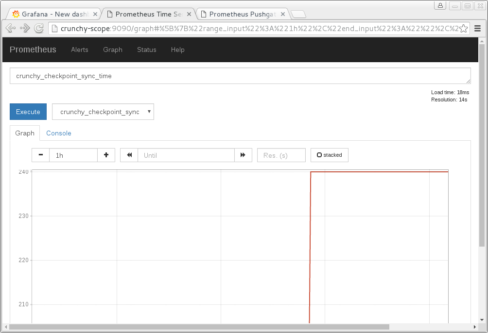

= Metrics Collection - Crunchy Containers for PostgreSQL
Crunchy Data Solutions, Inc.
v1.4.1, {docdate}
:title-logo-image: image:crunchy_logo.png["CrunchyData Logo",align="center",scaledwidth="80%"]

== Collected Metrics

== Description
PostgreSQL metrics are collected by the crunchy-collect container, which collects 32 different
PostgreSQL metrics from a database container and pushes them to a Prometheus time series data
store. A web-based graphing dashboard, Grafana, runs from crunchy-grafana, which displays the
collected PostgreSQL metrics from the crunchy-prometheus container as a data source and uses
the metrics to build dashboards.

To start collection of metrics on a PostgreSQL database, you add the crunchy-collect container
into the pod that holds the crunchy-postgres container.

=== Overview
Metrics are stored in the crunchy-prometheus container, which runs the Prometheus time series
database. The Prometheus pushgateway is found within the crunchy-promgateway container, and
the Grafana web application is found within the crunchy-grafana container.

The crunchy-prometheus data in this example is stored in emptyDir volume types. To persist the
data and Grafana templates long term, you will want to use NFS volume types as specified in
the script examples/openshift/metrics/run-pvc.sh.

When running crunchy-metrics, the following ports are available:

 * crunchy-prometheus:9090 - the Prometheus web user interface
 * crunchy-promgateway:9091 - the Prometheus pushgateway REST API
 * crunchy-grafana:3000 - the Grafana web user interface

=== Examples

==== Docker

You can collect various PostgreSQL metrics from your database container by running a
crunchy-collect container that points to your database container.

Metrics collection requires you run the crunchy-metrics set of containers that includes:

 * Prometheus
 * Prometheus push gateway
 * Grafana

To start this set of containers, run the following:
....
cd $CCPROOT/examples/docker/metrics
./run.sh
....

An example has been provided that runs a database container
and also the associated metrics collection container, run the
example as follows:

....
cd $CCPROOT/examples/docker/collect
./run.sh
....

Every 3 minutes the collection container will collect PostgreSQL
metrics and push them to the Crunchy Prometheus database.  You
can graph them using the Crunchy Grafana container.

==== Kubernetes

This example starts up Prometheus, Grafana, and Prometheus gateway.

It is required to view or capture metrics collected by crunchy-collect.

Running the example:
....
examples/kube/metrics/run.sh
....

This will start up 3 containers and services:

 * Prometheus (http://crunchy-prometheus:9090)
 * Prometheus gateway (http://crunchy-promgateway:9091)
 * Grafana (http://crunchy-grafana:3000)

If you want your metrics and dashboards to persist to NFS, run
this script:
....
examples/kube/metrics/run-pvc.sh
....

In the docs folder of the github repo, check out the metrics.adoc
for details on the exact metrics being collected.

This example runs a pod that includes a database container and
a metrics collection container. A service is also created for the pod.

Running the example:
....
examples/kube/collect/run.sh
....

You can view the collect container logs using this command:
....
kubectl logs -c collect master-collect
....

You can access the database or drive load against it using
this command:
....
psql -h master-collect -U postgres postgres
....

==== OpenShift

First, create the crunchy-metrics pod which contains
the Prometheus data store and the Grafana graphing web application:

....
cd $CCPROOT/examples/openshift/metrics
./run.sh
....

At this point, you can view the Prometheus web console at
crunchy-metrics:9090, the Prometheus push gateway at crunchy-metrics:9091,
and the Grafana web app at crunchy-metrics:3000.

When accessing the Grafana web application, the default user credentials will be
the username **admin** and the password **admin**.

Next, start a PostgreSQL pod that has the crunchy-collect container
as follows:
....
cd $CCPROOT/examples/openshift/collect
./run.sh
....

At this point, metrics will be collected every 3 minutes and pushed
to Prometheus.  You can build graphs off the metrics using Grafana.

== crunchy-collect Environment Variables

 * POLL_INT - number of minutes to sleep until metrics are collected.  defaults to 15 minutes
 * PROM_GATEWAY - the http URL of the Prometheus pushgateway into which the metrics will be pushed.  defaults to http://crunchy-promgateway:9091

== Collected Metrics

.Table Connection Metrics
[format="csv", options="header"]
|===
Metric,Description,Scope,Unit
crunchy_connections, the number of active connections, database/cluster,count
|===

.Table Connection Utilization Metrics
[format="csv", options="header"]
|===
Metric,Description,Scope,Unit
crunchy_connectionutil, the percent utilization of max connections, cluster, percent
|===

.Table Database Size Metrics
[format="csv", options="header"]
|===
Metric,Description,Scope,Unit
crunchy_databasesize, the size in Megabytes of a database, database, megabytes
|===

.Table pg_stat_database Metrics
[format="csv", options="header"]
|===
Metric,Description,Scope,Unit
crunchy_xact_commit, Number of transactions in this database that have been committed, database, count
crunchy_xact_rollback, Number of transactions in this database that have been rolled back, database, count
crunchy_tup_returned, tup_returned, database, count
crunchy_tup_fetched, tup_fetched, database, count
crunchy_tup_inserted, tup_inserted, database, count
crunchy_tup_updated, tup_updated, database, count
crunchy_tup_deleted, tup_deleted, database, count
crunchy_conflicts, conflicts, database, count
crunchy_temp_files, temp_files, database, count
crunchy_temp_bytes, temp_bytes, database, count
crunchy_deadlocks, deadlocks, database, count
crunchy_blks_read, blks_read, database, count
crunchy_blks_hit, blks_hit, database, count
crunchy_hit_ratio, hit_ratio, database, percent
crunchy_blk_read_time, blk_read_time, database, time
crunchy_blk_write_time, blk_write_time, database, time
|===

.Table bgwriter Metrics
[format="csv", options="header"]
|===
Metric,Description,Scope,Unit
crunchy_checkpoints_timed, checkpoints_timed, cluster, count
crunchy_checkpoints_req, checkpoints_req, cluster, count
crunchy_checkpoint_write_time, checkpoint_write_time, cluster, count
crunchy_checkpoint_sync_time, checkpoint_sync_time, cluster, count
crunchy_buffers_checkpoint, buffers_checkpoint, cluster, count
crunchy_buffers_clean, buffers_clean, cluster, count
crunchy_maxwritten_clean, maxwritten_clean, cluster, count
crunchy_buffers_backend, buffers_backend, cluster, count
crunchy_buffers_backend_fsync, buffers_backend_fsync, cluster, count
crunchy_buffers_alloc, buffers_alloc, cluster, count
|===

.Table Table Size Metrics
[format="csv", options="header"]
|===
Metric,Description,Scope,Unit
crunchy_database_size, database_size in megs, database, megabytes
crunchy_table_size, table size in megs, database, megabytes
crunchy_index_size, index size in megs, database, megabytes
crunchy_total_size, total size in megs, database, megabytes
|===

.Table Dead Rows Metrics
[format="csv", options="header"]
|===
Metric,Description,Scope,Unit
crunchy_pct_dead, percentage dead rows in table, database, item
|===

.Table Lock Metrics
[format="csv", options="header"]
|===
Metric,Description,Scope,Unit
crunchy_lock_count, locks held for a database, database, count
|===

.Table pg_xlog Metrics
[format="csv", options="header"]
|===
Metric,Description,Scope,unit
*crunchy_xlog_count*,count of pg_xlog archive files,cluster,count
|===

<<<
== Grafana Dashboard

You can create dashboards of various graphs using the Grafana Dashboard
editor:

image::grafana-dashboard-sample.png[]

Some more information on creating custom Grafana dashboards can be found in the official documentation - http://docs.grafana.org/guides/getting_started/.

<<<
== Grafana Data Source

You create a Grafana data source that represents the Prometheus
database running within crunchy-prometheus:

image::grafana-data-source.png[]

<<<
== Prometheus Console

You can issue raw queries to Prometheus using its web
console:

== Legal Notices

Copyright © 2017 Crunchy Data Solutions, Inc.

CRUNCHY DATA SOLUTIONS, INC. PROVIDES THIS GUIDE "AS IS" WITHOUT WARRANTY OF ANY KIND, EITHER EXPRESS OR IMPLIED, INCLUDING, BUT NOT LIMITED TO, THE IMPLIED WARRANTIES OF NON INFRINGEMENT, MERCHANTABILITY OR FITNESS FOR A PARTICULAR PURPOSE.

Crunchy, Crunchy Data Solutions, Inc. and the Crunchy Hippo Logo are trademarks of Crunchy Data Solutions, Inc.
