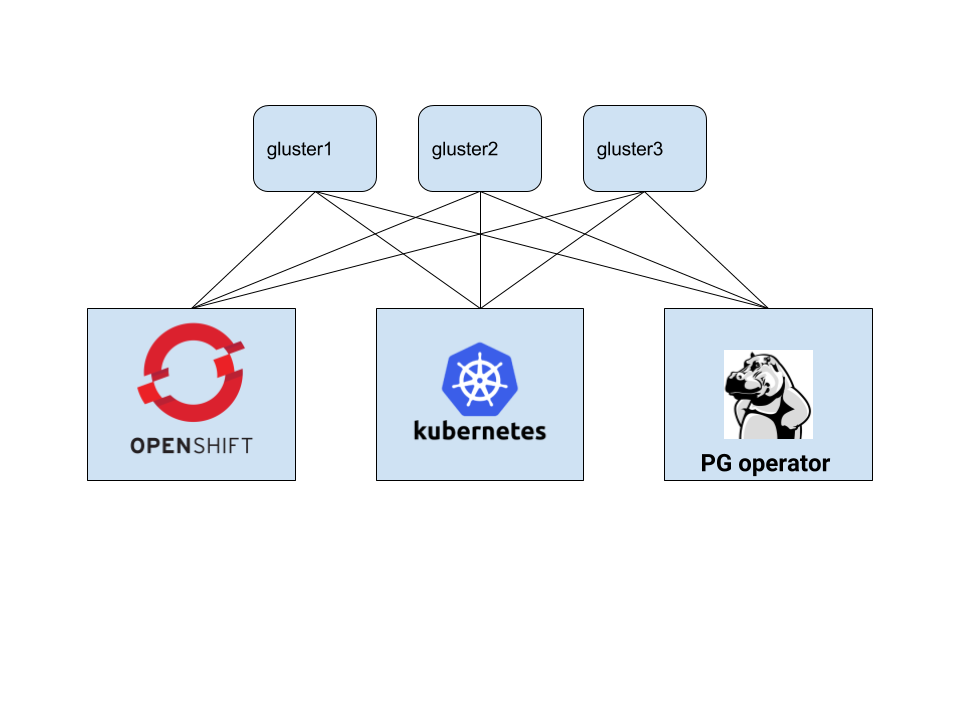

== Gluster Setup for General Testing

This document describes how to setup a 3 node Gluster
cluster which can be used to test dynamic storage
on a Kubernetes or OpenShift deployment concurrently.

Each VM has the following resources:

* CentOS 7 (Minimal)
* 2 GB memory
* 20 GB host disk
* 20 GB host disk dedicated for Gluster
* 1 CPU

The IP addresses and names for each VM will be configured similarly to the following sample /etc/hosts entry.
....
192.168.122.40 gluster1
192.168.122.20 gluster3
192.168.122.102 gluster2
....

These VMs will need a stable IP address that resolves on each host with each other as above.  Update the */etc/hosts* file on each VM to include all 3 VM IP addresses.

=== Install Dependencies
On each VM, install the dependencies:
....
yum -y update
yum -y install centos-release-gluster310
yum -y install glusterfs gluster-cli glusterfs-libs glusterfs-server
systemctl enable glusterd
systemctl start glusterd
....

=== Choose the Heketi Host
Heketi is a REST API for Gluster used to provide connectivity from Kubernetes to Gluster. It is only necessary to run Heketi on a single host. For this tutorial, install it on the gluster1 VM as follows:
....
yum -y install epel-release
yum -y install heketi-client heketi
....

=== Testing Environments
If working on a testing environment, a simple solution for avoiding issues with SELinux is to disable SELinux and stop the firewalld service. A more complex approach is strongly recommended when working within a production environment.
....
systemctl disable firewalld.service
systemctl stop firewalld.service
vi /etc/sysconfig/selinux
reboot
....

=== Gluster Disk Setup
On each Gluster host, a clean unused disk is required to be dedicated to Gluster. Ror this tutorial KVM is used to create a 20GB disk which on the VM is found at */dev/vdb*. These settings can be adjusted to suit specific requirements..

=== SSH Setup
Edit the */etc/sudoers* file on each host and add this line:
....
Defaults   requiretty
....

After that change, restart sshd:
....
systemctl restart sshd
....

On the Heketi host (gluster1), create a key like this:
....
ssh-keygen -f /etc/heketi/heketi_key -t rsa -N '’
....

Copy that key like this to the other hosts:
....
ssh-copy-id -i /etc/heketi/heketi_key root@gluster2
ssh-copy-id -i /etc/heketi/heketi_key root@gluster3
ssh-copy-id -i /etc/heketi/heketi_key root@gluster1
....
The requirement here is to have password-less sudo as the root user using that key for all Gluster nodes.

*Only install Heketi on gluster1 in this example.*

=== Heketi Setup

Sample Heketi configuration files are found in the GitHub */examples/gluster* directory. Copy the `heketi.json` and `topology-sample.json` files to `/etc/heketi` on the gluster1 node.

*Update the topology-sample.json file to specify the VMs IP addresses and Gluster disk paths.*

=== Load the Topology
....
export HEKETI_CLI_SERVER=http://gluster1:8080
heketi-cli topology load --json=/etc/heketi/topology-sample.json
....

Some Heketi CLI commands can be run to see what was just created
for you based on your topology-sample.json file:
....
heketi-cli topology info
heketi-cli cluster list
heketi-cli volume list
heketi-cli volume info
heketi-cli cluster info
....

=== Setup the Kubernetes or OpenShift Host for Gluster

On your Kubernetes or OpenShift host, install the Gluster dependencies:
....
yum -y install centos-release-gluster310
Yum -y install epel-release
yum -y install heketi-client
yum -y install glusterfs
yum -y install glusterfs-server glusterfs-fuse glusterfs-cli
....

=== Define the Gluster Heketi Host
*In /etc/hosts add an entry for the gluster1 host.*

=== Create the storage class on Kubernetes

Copy the sample `gluster-storage-class.yaml` file from the
*/examples/gluster* folder to your Kubernetes or OpenShift host and execute the following:
....
kubectl create -f gluster-storage-class.yaml
kubectl get sc
....

This will create a storage class you can then use within your PVCs.

=== Create a Test PVC

An example PVC using this StorageClass is found in the */examples/gluster*
folder:
....
kubectl create -f test-pvc.json
kubectl get pvc test-pvc
....

== Testing

The Container Suite and the PostgreSQL Operator can now be tested using the
same standalone Gluster cluster on Kubernetes and OpenShift. This will be the
only cluster to be set up and maintained.

== References

https://github.com/heketi/heketi/blob/master/doc/admin/readme.md

http://neharawat.in/glusterfs-volume-management-using-heketi/

https://github.com/gluster/gluster-kubernetes/blob/master/docs/examples/hello_world/README.md

https://blog.lwolf.org/post/how-i-deployed-glusterfs-cluster-to-kubernetes/
